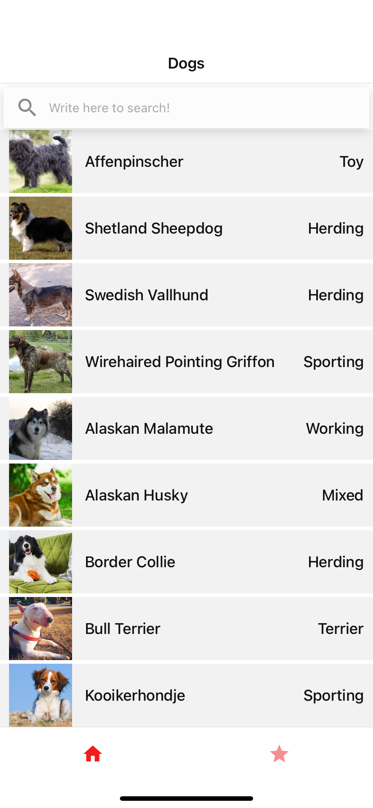
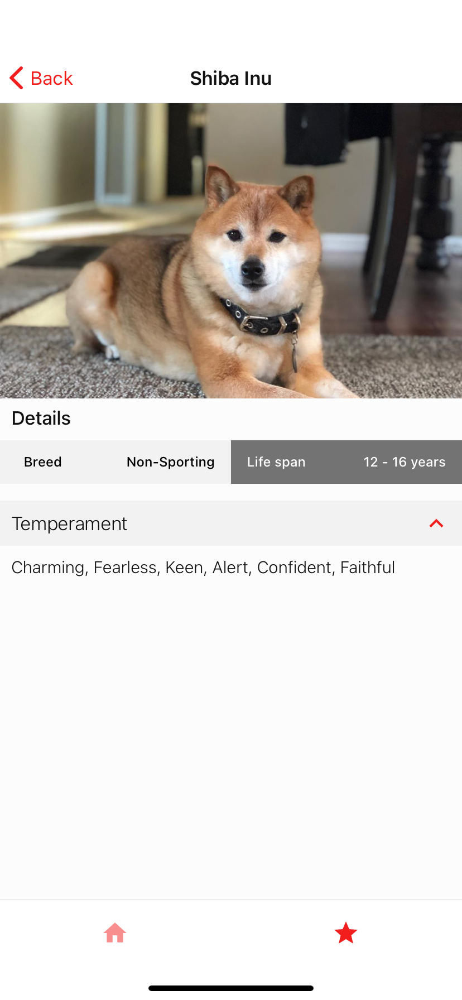
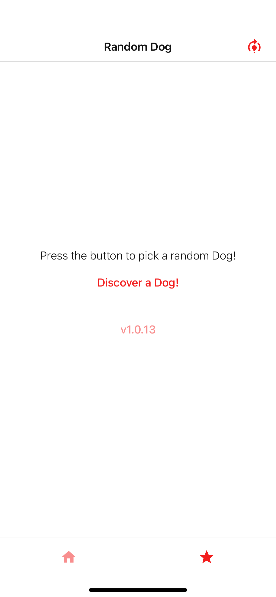
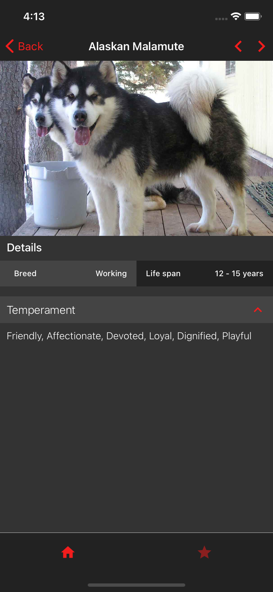
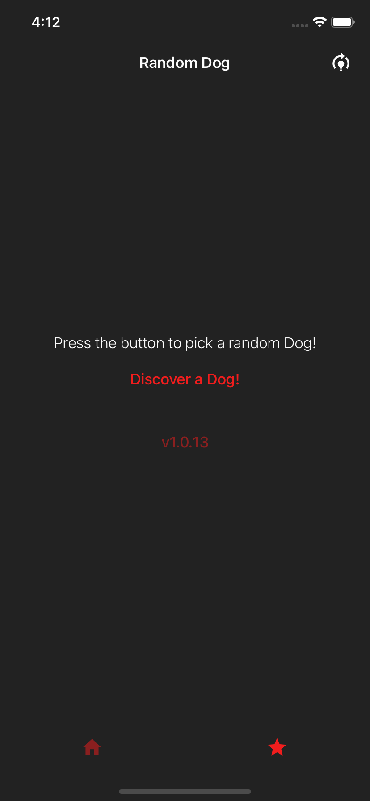

# Clean Animals
## Simple app to practice quality code techniques

## Pages
##### List
- list animals with pagination
- filter animals

##### Discover animal
- discover a random animal
- change app's theme (light/dark)

##### Detail
- display details fo the animal
- navigate between animals
- preload more animals as user get close to the end of the "horizontal" pagination

## Technical objectives
- [x] Clean Code

- [x] Clean Architecture

- [x] TDD - Unit, Integration, E2E (Jest, Enzyme and Detox)

- [x] Typescript

- [x] Theme functionality

- [x] Push Notifications

## GIF

## Screenshots
 

 

